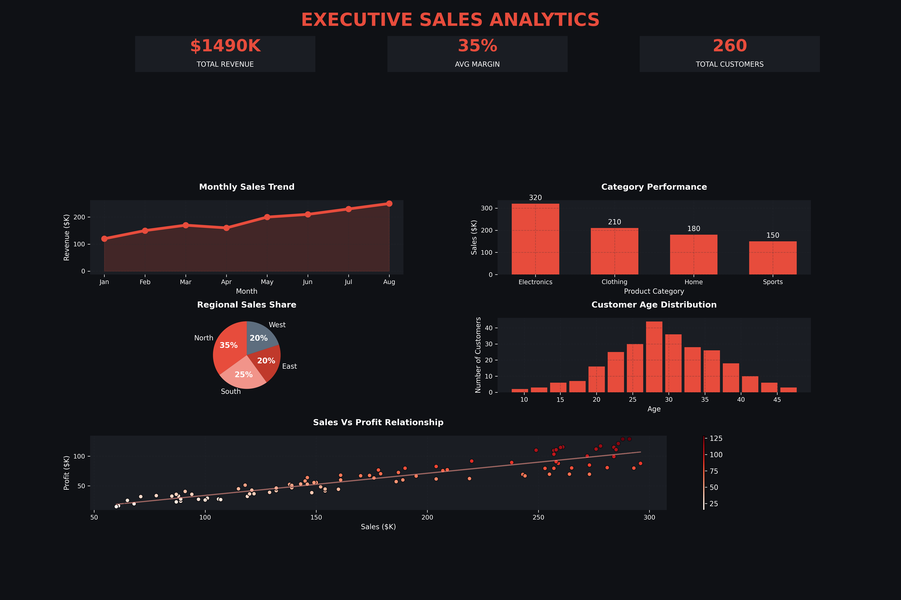

# Executive Sales Analytics Dashboard

A professional business analytics dashboard built using Python and Matplotlib.

This project demonstrates how Python can be used to design executive-level
data visualization dashboards similar to business intelligence tools.

## Dashboard Features

• KPI summary cards  
• Monthly sales trend visualization  
• Product category performance analysis  
• Regional sales distribution  
• Customer age demographic analysis  
• Sales vs profit scatter analysis  
• Regression trend line for profit prediction  
• Custom executive dark theme dashboard  

## Technologies Used

Python  
Matplotlib  
NumPy  
Jupyter Notebook  

## Dashboard Preview



## Project Structure

```text
executive-sales-analytics-dashboard

executive-sales-analytics-dashboard/
│
├── images/
│   └── dashboard_preview.png
├── notebook/
│   └── sales_dashboard.ipynb
├── src/
│   └── dashboard.py
├── .gitignore
├── README.md
└── requirements.txt
## Purpose

The goal of this project is to demonstrate advanced data visualization
and dashboard design using Python.

### 3. Add a "How to Run" Section (Optional but Recommended)
Recruiters love to see how they can run your code. You can add this small section at the bottom:

## How to Run
1. Clone the repository:
   `git clone https://github.com`
2. Install dependencies:
   `pip install -r requirements.txt`
3. Run the dashboard:
   `python src/dashboard.py`
